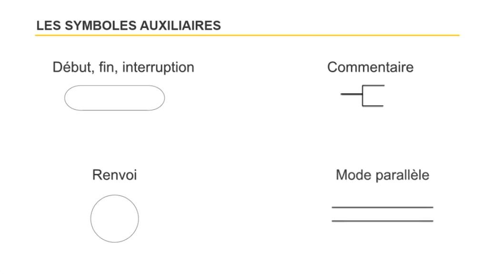
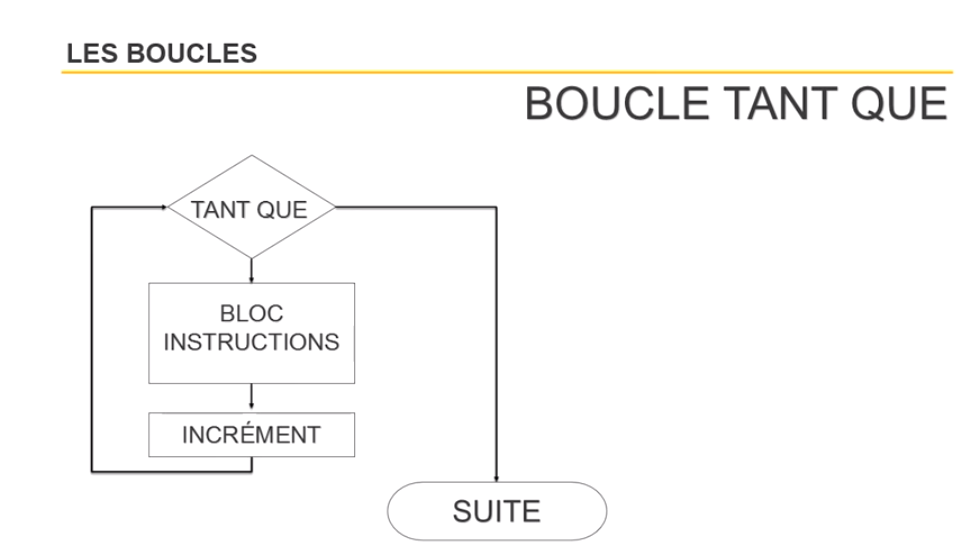

## Analyser un problème à l'aide de la table de décision

Exemple de cas (problème) :

"L'entreprise X vend des produits.

Pour la livraison des produits, 

si le client est dans un rayon de 20 km et si le montant HT est >= 800€, pas de frais.
Sinon un forfait de 30€ est appliqué.

si le client est en dehors d'un rayon de 20 km et si le montant HT est < 800€, les frais sont de 50€.
Sinon un forfait de 30€ est appliqué."

**Créer une table de décision**

1. Trouver vos conditions liées à votre problème

Il y a deux conditions, dans un rayon de 20 km et montant supérieur à 800 €

2. Trouver le nombre de possibilité (règles) lié à vos conditions

Pour ce faire, il suffit d'appliquer une formule.

```
Nombre de possibilité = 2 exposant le nombre de condition
```
Décortiquons cette formule :

le premier nombre est 2 parce que une condition peut être respecter ou non ce qui fait déjà 2 règles

exposant = puissance

```
2 ** 2 = 4 Nombre de possibilité
```

3. Trouver les actions à effectués en fonction des conditions

Rendre gratuit les frais de port, appliquer un forfait de 30 € et appliquer un forfait de 50 €


Exemple de table de décision :


## Analyser un problème à l'aide de l'organigramme

Ci-dessous, vous trouverez les symboles à utiliser dans un organigramme pour qu'il soit compris par tout le monde.




**Détail des symboles de condition**


**Détail des symboles de boucle**




**Exemple avec la table de décision précédemment crée**


**Autre possibilité**


### Ecrire du pseudo code

Le pseudo code permet de traduire l'organigramme avec des mots proches d'un langage de programmation. Le le but est d'utiliser des mots simple pour comprendre comment enchaîner les instructions en programmation.

Comme en code, il est important de respecter l'indentation.


---------------------------------------------
[Retour au sommaire](README.md)