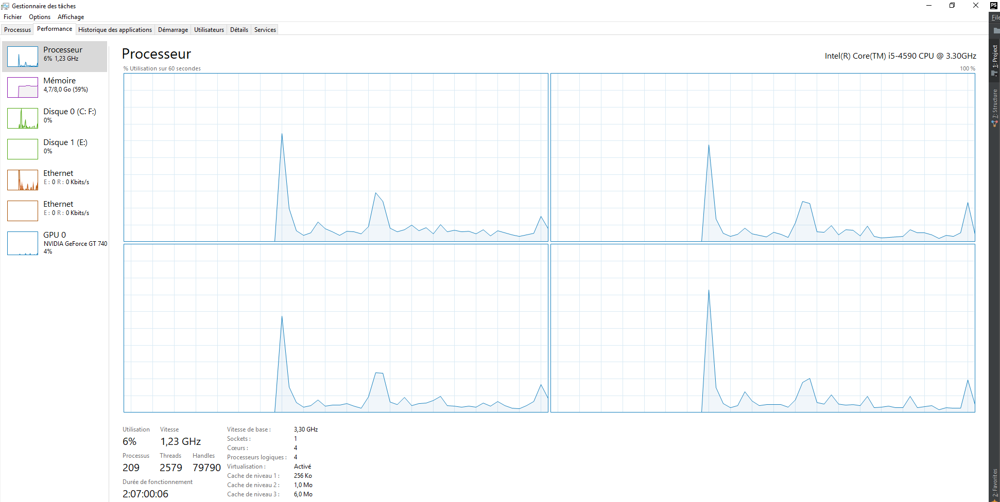

# L'efficacité des algorithmes

Lorsque votre application tourne une première chose à visualiser est l'utilisation du CPU.

Cela dit, c'est relatif à votre type d'application...

20% d'utilisation du CPU pour un jeux 3D, c'est correct.

20% d'utilisation du CPU pour une calculatrice, c'est beaucoup de trop.

Sur MacOs, n'oubliez pas d'utiliser Instruments, la partie Time profiler. Afin de voir l'activité du CPU.

Pour les ordinateur doté de multi coeur, le système partage la charge de travaille de manière +- égal afin de ne pas solicité qu'un seul CPU.

Donc ne regarder pas que le graphique global, regarder les graphique de chaque CPU.

Exemple sur Windows :

 


Une manière de vérifier la rapidité de son algorithme, c'est de placer des prints (echo) au début et à la fin du code afin de voir le temps que prends le script à s'exécuter.

Ses print sont souvent accompagnés d'affichage de date et d'heure.

Exemple PHP :

````php
generateInvoice(){
    echo "start".date('h:i:s').PHP_EOL;
    // Instructions
    echo "end".date('h:i:s').PHP_EOL;
}
````

Ou vous utilisez des logiciels dit "step by step", ils arrête le logiciel à des points précis (exemple en PHP, XDEBUG).


Exemple Javascript :

En javascript, vous pouvez créer un timer qui vous affiche le temps pris en millisecondes.

````javascript
window.onload = function() {
  console.time('myTimer');
  // Instructions
  console.timeEnd('myTimer');
}
````


En javascript, il est possible également d'activer un profiler pour visualiser une partie du code.

````javascript
window.onload = function() {
  console.profile('test action 1');
  // Instructions
  console.profileEnd('test action 1');
}
````


:exclamation: Lorsque vous avez fini, n'oubliez pas de retirer vos tests.

## Les exemples d'instructions susceptibles d'être gourmandes sont : 

- Un gros fichier JSON ou XML à décoder (parser) et à manipuler
- En générale, la transformation de données (parsing) est gourmande
- Ordonner (trier) un gros tableau
- Recherche dans un gros tableau, si vous connaissez l'index c'est mieux
- Instanciation de gros objet
- Instanciation dans une boucle (éviter un maximum)
- Boucle avec beaucoup d'itérations
- Boucle avec plusieurs imbrications
- La lecture ou la manipulation de fichier lourd (image, vidéo, long texte,...)
- Concaténation de chaîne de caractère, privilégié les fonctions prévues de votre langages au lieu d'effectuer des boucles avec le signe +.

:bulb: Ordre de grandeur

Pour vous donnez une idée d'une durée de temps d'exécution, pensez en millisecondes.

Exemples :

Retour d'une requète HTTP prends en moyenne 100 milisecondes mais tout dépends du poids du body...


