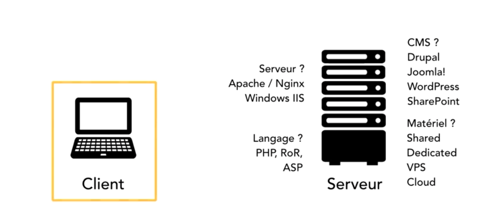

# L'efficacité du code

Dans cette partie des notes, nous allons voir comment optimiser et améliorer son code.

Devenir efficace !

## fausses idées

- L'amélioration de l'efficacité d'une application peut se faire par un copier-coller du manuel.

- Il faut être un gourou du code pour optimiser une application ou son environnement.


## Règles de bases

- Garder votre code simple, lisible et **modulaire**
- Penser optimisation seulement lorsque toute l'application est ok (sans bug)
- N'écouter votre intuition, basez vous sur les faits.


## Outils de monitoring

Dans ces outils de monitoring, vous pouvez visualiser ce que votre programme consomme en terme de mémoire, en terme de pourcentage d'utilisation du processeur.

- Sur Windows, vous allez dans le gestionnaire de tâches
- Sur Mac, vous allez dans le moniteur d'activité

### Dans le terminal UNIX (linux & MacOs) :

Dans les commandes ci-dessous, PID est égal à l'id de votre programme donc si vous souhaiter utiliser ces commandes remplacer-le :smiley:.

Voir un processus (programme executé) en cours d'utilisation via son nom

````
ps -A | grep Nom
````

Grâce au PID, vous pouvez effectuer des actions sur ce même processus.

Forcer l'arrêt

````
kill -9 pid
````

La commande ``top`` permet de voir tout ce qui se passe sur la machine

En gros, lorsque vous allez utiliser votre application, regarder ce qu'elle consomme.

Pour visualiser ce votre programme utilise comme fichier, la commande ``lsof`` est parfaite.

Elle prends en argument le PID du programme :

````
lsof -p PID
````
 
Grâce à ``lsof`` , vous constaterez directement si votre application charge (utilise) un fichier incohérent ou trop lour.

La commande ``fs_usage PID``, vous permet de voir ce que le programme utilise en système (file system).

La commande ``heap PID`` affiche l'utiliation mémoire sur le système de votre programme.


### Dans Windows :

Sur [sysinternals](https://live.sysinternals.com/), vous pouvez télécharger procmon.exe (process monitor) et procexp.exe (process explorer).

Comme c'est des executable, il suffit de cliquer dessus.


Il y a également le Windows Perfomance Recorder qui permet d'enregistrer les performances.


## Boite à outils

- Java
    - JVM Monitor, il peut être récupérer sur le marketplace d'eclipse.
    - Visual VM
    - Pour Android : Traceview et Systrace
    
- iOS / Mac
    - Instruments
    
- Visual Studio
    - Il intègre déjà pas mal d'outils de performance.
    
- Non-IDE
    - Performance côté langage
    
        Pour Python, il y a cProfile (CLI)
        
        Pour Ruby, il y a rprofile et ruby-prof
    
    
## Application Web

Voici ce qui rentre en ligne de compte pour les performance d'une application Web



:exclamation: Toujours mais TOUJOURS ouvrir l'outils inspecter de votre navigateur ! 

J'ai une préférence pour l'outils de chrome.

F12 est votre meilleur ami
