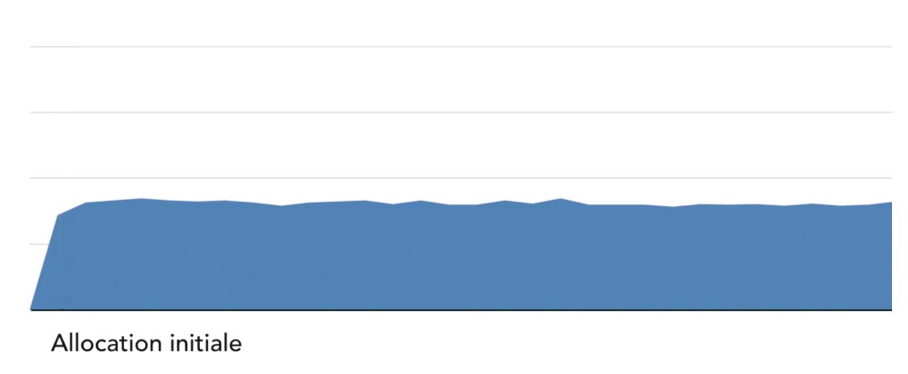
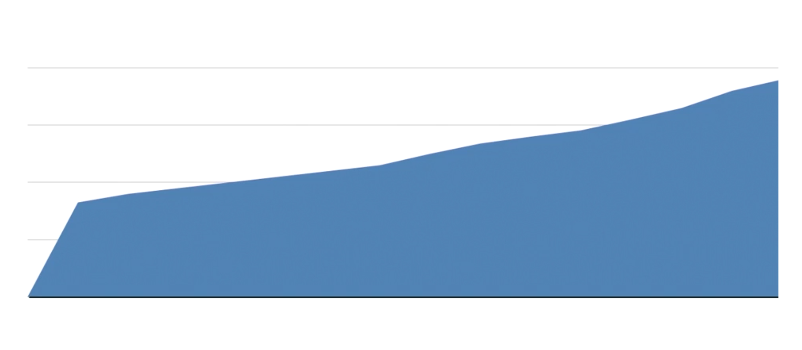
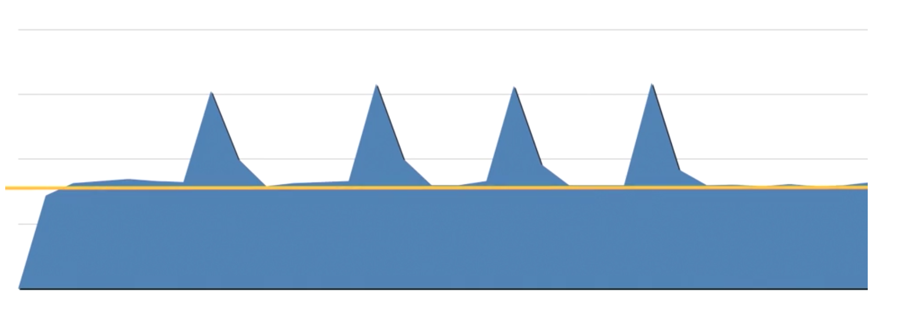

# Efficacité de la mémoire

## Quelles sont les éléments sur lesquelles, il faut faire attntion ?

- Des fuites de mémoire (trop de mémoire utilisée)

    - Lorsqu'un objet n'est plus utilisé, supprimer-le
    
    - Faite attention aux variables non utilisées.
    
- Des objets très gourmands

    - Les éléments mal codé qui consomme trop de mémoire
    
- Consommations inexpliquées

    - Cela risque de vous énormément de temps mais il est impératif de trouver la raison...
    
    
Exemple d'un bon graphique d'allocation de mémoire :

  

  
Exemples d'un mauvais graphique d'allocation de mémoire :






## Que faut-il vérifier dans le code ?

- Les instances de classe dans une boucle (surtout celle avec beaucoup itération)
    
    Essayer toujours de ne pas instancier dans une boucle avec plus de 10 itérations...
    
    Exemple à ne pas suivre : 
    
    ````
    while (position < 10000){
      Asteroid a = new Asteroid();
      //passer à un autre contexte ?
      doInterestingStuff(a);
      //ajouter à une autre collection ?
      myAsteroidArray.add(a);
      
    }
    ````
    
- Les longue trainée, les imbrication d'objet imbriqué dans d'autre et ainsi de suite.

    Envité trop de profondeur dans vos imbrication d'objet.
    
    Si on instancie une classe qui provoque 20 autres instanciations, cela est vraiment problématique !
    
- Effectuer la plus possible du "à la demande"

     Imaginons que j'ai une classe Utilisateur avec une image.
     
     Cette image est une autre classe.
     
     Lorsque j'instancie Utilisateur, pas besoin forcément d'instancier la classe Image...
     
     Je peux créer une méthode qui instancira "à la demande" l'image.
     
     Il faut mieux instancier une relation seulement "à la demande". 
     C'est pas parce qu'on instancie une classe qu'il faut instancier les sous classe.
     
- Effectuer des vérifications sur les objets susceptible d'être vide car cela peut provoquer des bugs et de l'allocation de mémoire inutile.


## environnement et langage

Dans certains langage la gestion de la mémoire est automatique mais dans d'autres il faut l'effectuer soit même.

- Automatique (garbage collector)
       
    - Java
    - C#, VB.NET
    - Ruby
    - Python

- Manuel
    
    - C, C++
    - Objective-C
    
### Manuel vs Automatique

**Manuel**

- inconvénients : 

    - Difficile à gérer
    - Plus de risque de bugs

- Avantages :

    - Très rapide
    - On choisit tout
    
    
**Automatique**

- inconvénients : 

    - Très lent
    - Aucun contôle

- Avantages :

    - Gérer facilement
    - Peu de bugs
    
     

### Garbage Collector
 
Il s'occupe de tout pour nous.

- Il faut vraiment bien comprendre le fonctionnement de votre langage
- Garbage Collector peut lire et décider selon votre code, pas selon votre cerveau


## Les testes mémoire

Lorsque vous testez la mémoire, mettez vous en situation non optimale.

Exemple, tester votre programme avec un ordinateur moyenne (bas de gamme) ou avec un téléphone mais pas avec une machine de guerre.

Tester les process les plus susceptible d'être lourd.


