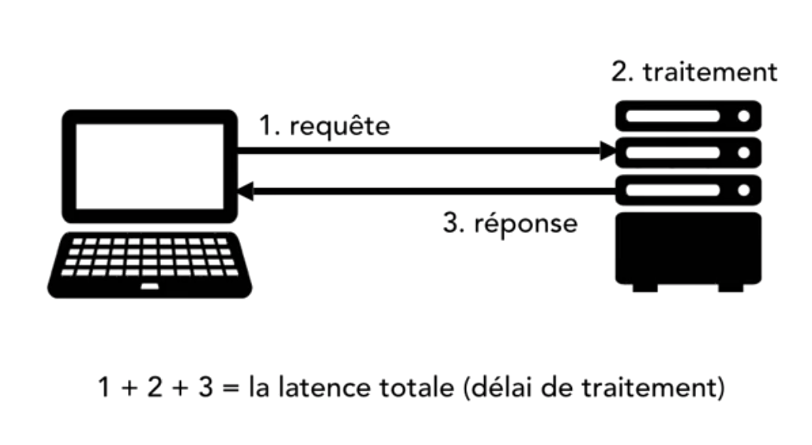

# Efficacité du réseau


Quand on parle de réseau, on parle d'un ordinateur qui se connecte à un serveur (internet ou intranet) pour récupérer de l'information.

Avec le réseau, il peut y avoir de la latence donc veuillez à la minimiser 

Il peut y avoir de la latence au moment de l'envoie mais aussi au moment de la reception.

 

N'oubliez que c'est facilement mesurable...

La latence peut être due à la distance.

Lorsque vous envoyez une requête sur internet, cette requête n'arrive pas directement sur le serveur...
Il y des point de jonction entre, ces points de jonctions sont des serveurs par lesquelles votre requète passe.


Sur le terminal de windows, vous pouvez utiliser ``tracert`` pour voir les points de jonction (serveur intermédiaire) entre vous et le serveur.

````
tracert github.com
````

Avec la commande ci-dessus, je visualise les intermidiaire entre moi et le serveur où sur trouve GitHub.
Cette commande est également disponible sur linux & MacOs.

:bulb: Pour diminuer les points de jonction, il vaut prendre un serveur proche de la population qui utilise votre application.

Par exemple avec [Amazon](https://aws.amazon.com/fr/) (pas la boutique :smiley:), vous pouvez choisir dans qu'elle région est situé votre serveur. 

Pour une application internationnale, vous pouvez utiliser plusieurs serveurs répartis par région.

Il faut bien analyser 3 choses lors d'un problème de performance réseau :

- Est-ce le temps de la requête ?
- Est-ce le temps de la réponse ?
- Est-ce le temps de traitement de mon serveur ?


**Conseils :**

- Utiliser des CDN (Content Delivery Network) pour vos fichiers média (images, vidéos, CSS ...)

    Amazon CloudFront, EdgeCast, Windows Azure CDN
    
    Les CDN choisissent le meilleur chemin entre l'utilisateur et les médias.
    
    En faite, le CDN fait un duplicata de vos médias sur plusieurs serveurs sur la planète et il ira chercher vos media en fonction de la situation géographique de votre utilisateur.
    
- Compressez vos fichiers d'assets

    Compressez vos fichier Javascript, CSS et autres afin de réduire la charge réseau !
    
    Il y a webpack, gulp, gruntjs et bien d'autres...
    
- Compressez via le protocole

    HTTP propose la compression, le gzip. Il est facile à mettre en place sur votre serveur.

- Utiliser du cache!

    Que ce soit pour votre application, pour votre base de données, etc... Utiliser du cache !