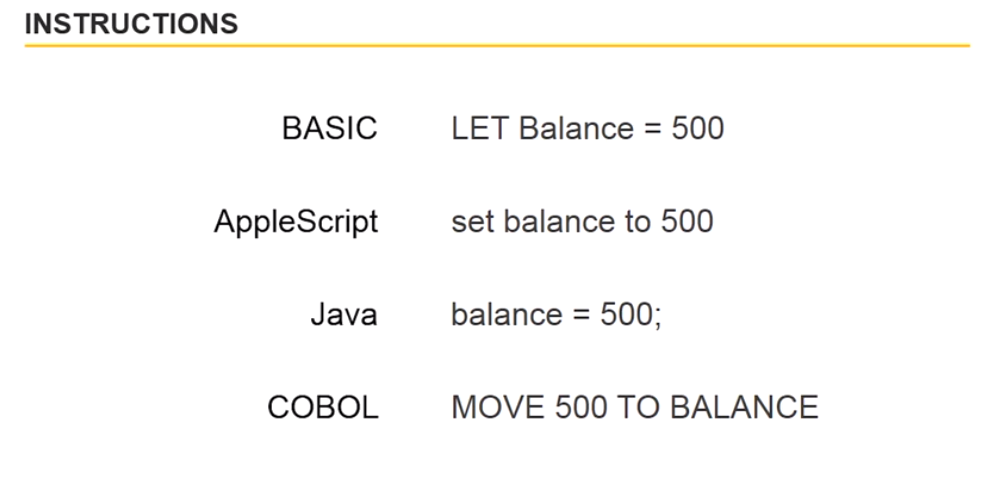
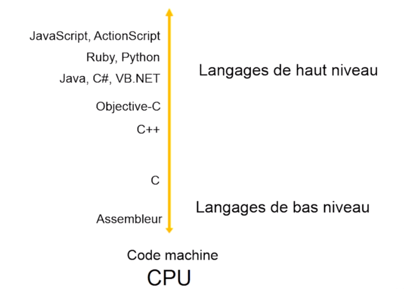
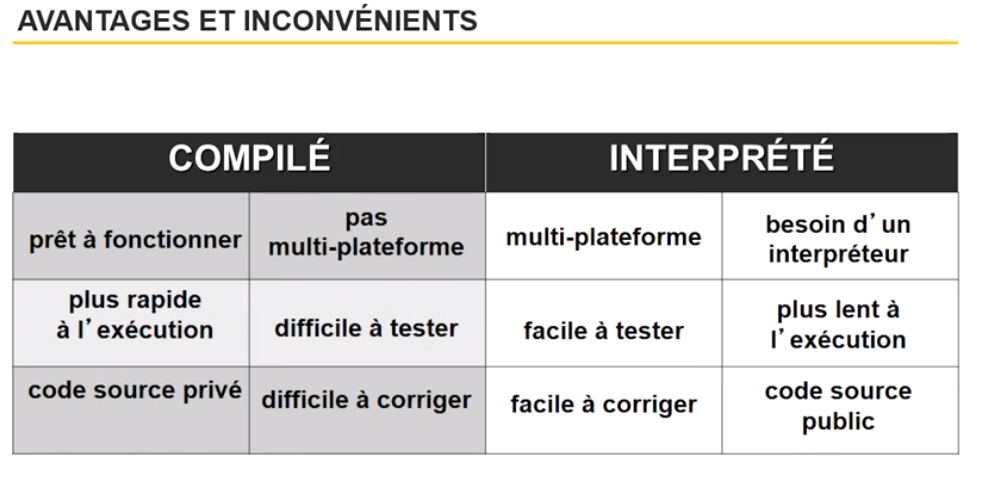
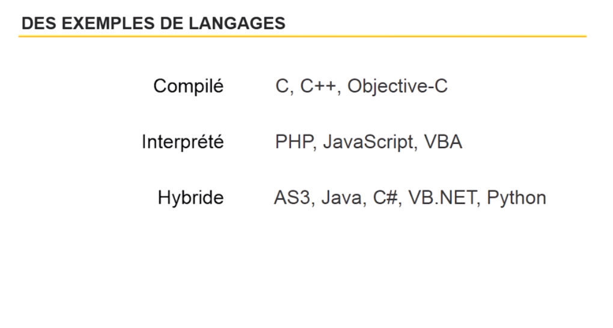

## Connaître les bases pour bien comprendre la programmation

**Qu'est ce qu'un programme ?**

"C'est une séries d'instructions que doit executer l'ordinateur..."

L'ordre des insctructions est important pour le bon fonctionnement du programme.

**Une instruction**

C'est une phrase. Dans cette phrase, il y a des mots clés. Ces mots clés vont être reconnus par l'ordinateur. En fonction des mots clés et de l'ordre dont ces mots clés vont arriver, l'ordinateur executera ce qu'on va lui demander.

**Définir un langage de programmation**

Plus un langage est éloigné du langage machine, plus il est sophistiqué et facile à utiliser mais il sera plus lent à l'execution.

Le premier langage dit de "bas niveau" est l'assembleur. c'est très difficile et il faut connaître l'hexadécimale. De plus, l'assembleur dépend du micro-processeur, les instructions peuvent être différentes en fonctions du micro-processeur donc il faudrait écrire son programme plusieurs fois en fonction du micro-processeur.

Les langages de haut niveau sont plus proches du langages humain.

Au départ, il est préférable d'apprendre de langages de haut niveau et au fur et à mesure de votre expérience, vous pouvez apprendre des langages de niveau plus bas.

Si le langages est complexe, n'hésiter à utiliser un IDE destiné au langages... Evitez les simples éditeurs de texte.

Les IDE vont vous aider en intégrant pas mal de librairie et de en auto-complétant vos instructions.

**Langage interprété ou langage compilé**

Interprété :

On écrit le code source et on envoie le code source

Compilé :

On écrit le code source, on compile et on envoie l'executable

Hybride (intermédiaire) : 

On écrit le code source, on effectue une pré-compilation, on envoie la pré-compilation et le receveur doit posséder l'utilitaire qui finira la compilation afin qu'il soit executable.

Explication avec le langage Java : 

Java est un langage de programmation compilé, mais plutôt que de compiler directement vers un code machine exécutable, il est compilé en une forme binaire intermédiaire appelée code octet JVM. Le code d'octet est ensuite compilé et / ou interprété pour exécuter le programme.

Java est un langage compilé en octets qui cible une plate-forme appelée Java Virtual Machine qui est basée sur une pile et possède des implémentations très rapides sur de nombreuses plates-formes.

Pour être clair, le Java est (généralement) compilé en bytecode, bytecode qui sera ensuite interprété par une machine virtuelle (dans le cas de Java on nomme cette machine virtuelle JVM : Java Virtual Machine).

Mais, au fond, je dirais que le fait qu'un langage soit compilé, interprété, ou un mix des deux ne devrait pas être un facteur premier quant au choix du langage en lui-même. 
Beaucoup d'autres considérations et facteurs devraient entrer en compte avant de choisir un langage.

**Organiser son code**

1. Commenter, commenter, commenter votre code! 

    6 mois après avoir écrit son code, il est possible d'avoir totalement oublier ce qu'on a écrit...

    Lorsque vous avez beaucoup de code, il est conseillé d'écrire un commentaire tous les 2-3 lignes.

2. Sincer votre code en fonction

    Afin d'éviter d'écrire ou lire du code trop long, n'hésiter pas une créer des fonctions. De plus, celles-ci seront réutilisables...
    Une règle de base, c'est de ne pas dupliquer du code si on peut en créer une fonction...

3. Sincer votre code en plusieurs fichiers

    Afin d'éviter un gros code à écrire ou lire sur un même fichier, n'hésiter pas une créer des fonctions. De plus, celles-ci seront réutilisables...

---------------------------------------------
[Retour au sommaire](README.md)