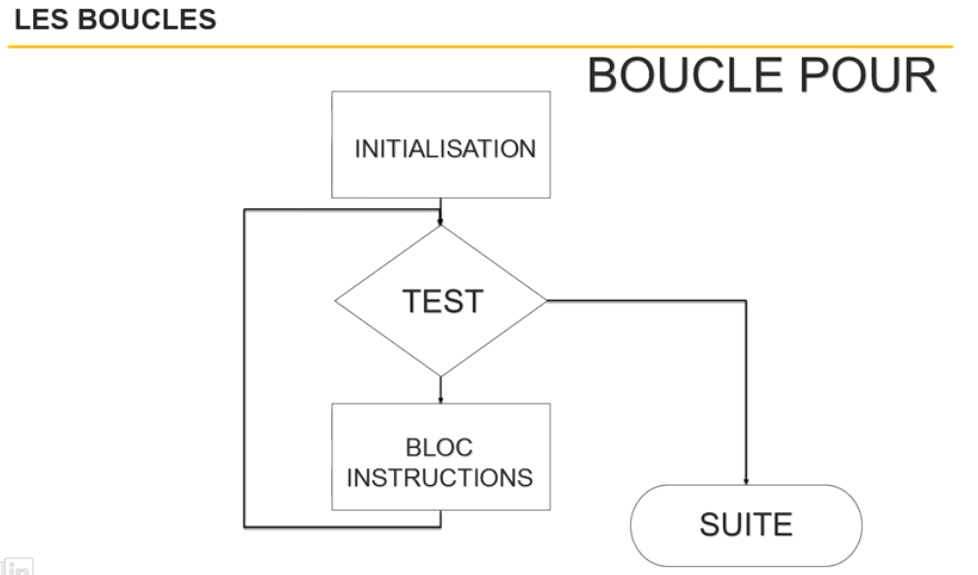
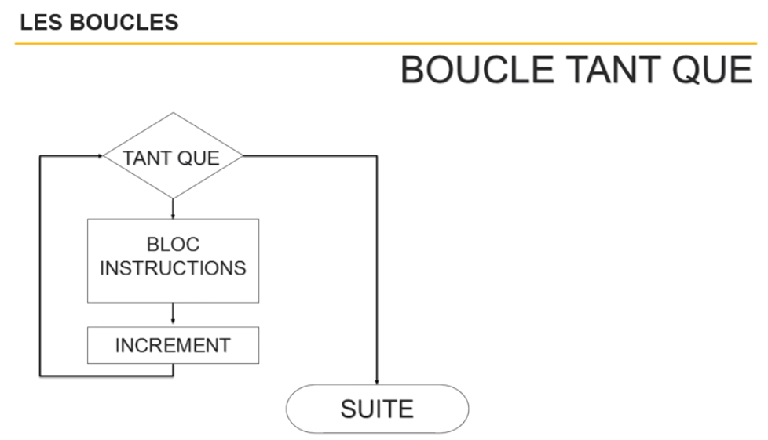
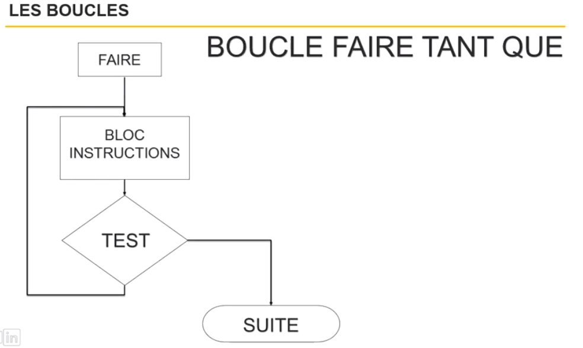

# Réaliser des traitements itératifs

**Qu'est ce qu'une boucle ?**

Les boucle permettent d'effectuer x fois les mêmes insctructions.
X peut être de 1 à l'infini ou n'import qu'elle nombre...

Il y a 3 manières d'effectuer une boucle :

- la boucle dit "for"
- la boucle "while", dit "tant que"
- la boucle dit "faire tant que"

Un boucle est toujours liée à une condition. Il est donc important d'avoir bien compris le chapitre précédent sur les conditions.

**La boucle for**

Le mot-clé est souvent ``for``

Fonctionnement :

- Créer un compteur
- Fixer une valeur maximum pour le compteur
- L'ordinateur sortira de la boucle lorsqu'il aura atteint le nombre maximum
- Tant que la valeur maximum n'est pas atteinte, les instructions continuent à s'executer.



Exemple Javascript :

```
for(Initialisation de index ; test de condition ; Incrémentation index){
 // action
 // action
 // action
}
```

```
for(var compteur = 1 ; compteur < 10 ; compteur++){
 // action
 // action
 // action
}
```


**La boucle tant que**

Le mot-clé est souvent ``while``

Fonctionnement :

- Ici pas besoin de compteur, juste une condition
- L'ordinateur sortira de la boucle lorsque la condition sera remplie (respectée)
- Si la condition n'est pas remplie, l'ordinateur continue les instructions.
- La condition est vérifiée avant les instructions.



Exemple Javascript :

```
while(test condition){
 // action
 // action
 // action
}
```

```
var compteur = 1;
while(compteur < 10){
 // action
 // action
 // action
 compteur++;
}
```

:exclamation: Si vous souhaitez utiliser un compteur pour la boucle while, n'oublier pas d'incrémenter sinon vous serez dans une boucle infinie.


**La boucle faire tant que**

Le mot-clé est souvent ``do while``

Fonctionnement :

- C'est presque pareil que le type de boucle précédente sauf la condition est vérifiée après. Ce qui implique une itération supplémentaire. 
- Vos instructions se feront au moins une fois !




```
var compteur = 1;
do {
    // action
    // action
    // action
    compteur++;
    } while(compteur < 10)
```


:exclamation: Si vous souhaitez utiliser un compteur pour la boucle do while, n'oublier pas d'incrémenter sinon vous serez dans une boucle infinie.


**Boucles imbriquées**

L'utilisation peut être pratique lorqu'on a un tableau et qu'on souhaite se déplacer à la fois verticalement et horizontalement.

On fera une première boucle pour le déplacement verticale et puis on fera une autre boucle pour le déplacement horizontale. Le seconde boucle sera imbriquée dans la première.


```
for(var compteur = 1 ; compteur < 10 ; compteur++){
    for(var autreCompteur = 1 ; autreCompteur < 10 ; autreCompteur++){
     // action
     // action
     // action
    }
 // action
 // action
 // action
}
```


---------------------------------------------
[Retour au sommaire](README.md)