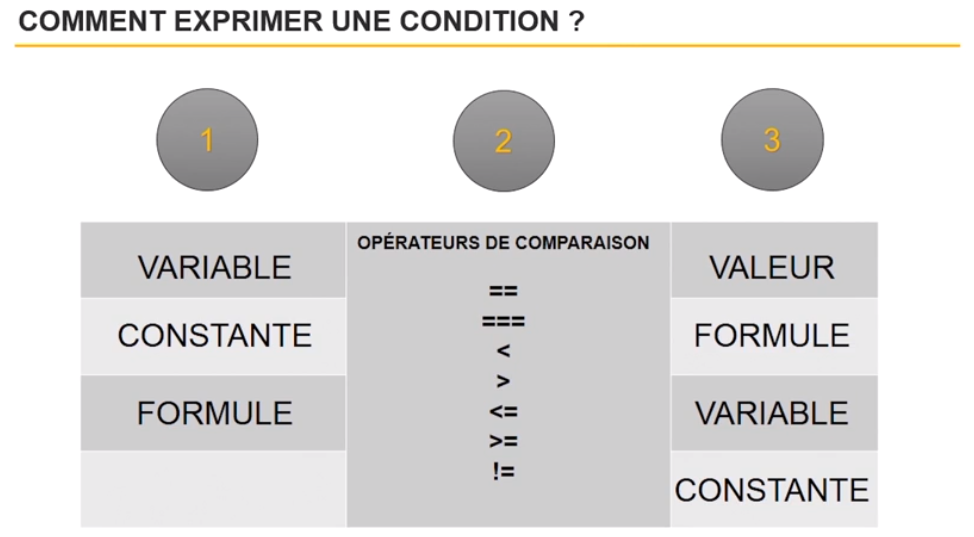
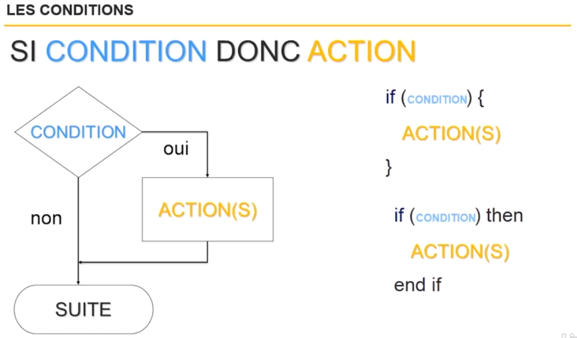
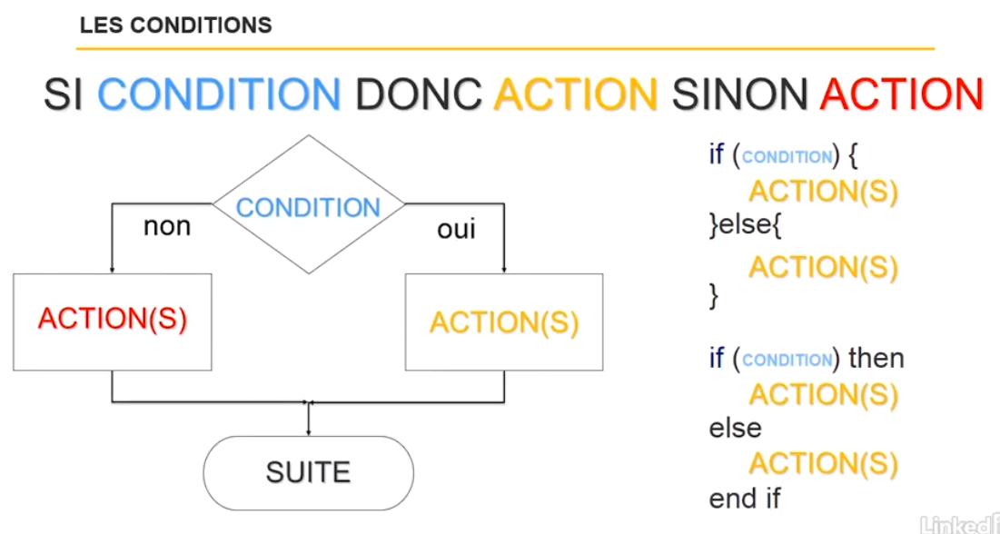
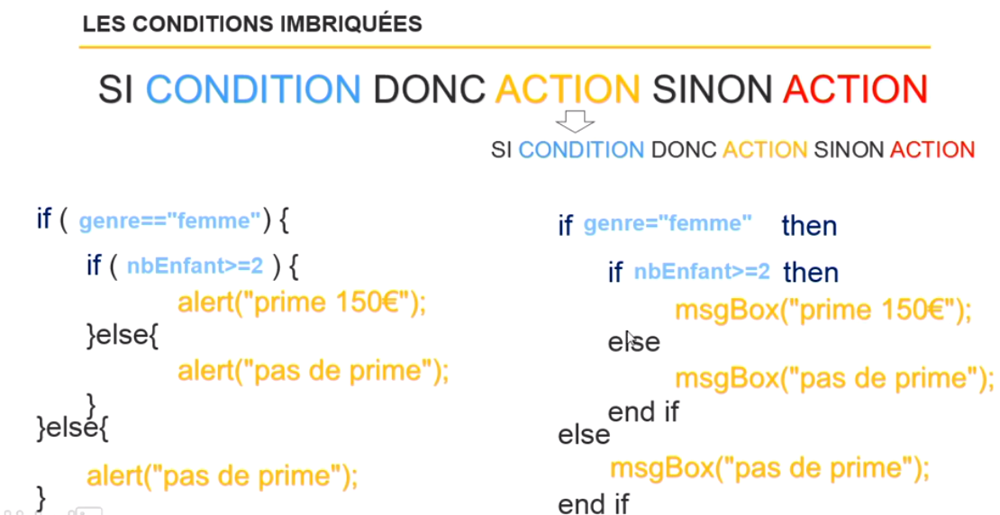
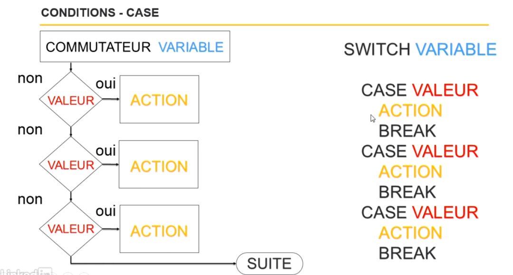

# Effectuer les traitements conditionnels

Exemple de condition :

Un client rempli un formulaire et il oublie de remplir le champ nom.

Dans notre code, il faudra metre une condition que si le champ nom n'est pas rempli, on affiche un message d'erreur...


**Comment exprimer une condition ?**

Une condition est une réunion de 3 éléments :

- une variable ou constante ou formule
- un opérateur de comparaison
- une variable ou constante ou formule



Avec de coder, réfléchisser pour savoir si vous avez bien ces 3 éléments!

Condition simple :



Condition avec sinon :




```
Vrai ou faux

if(condition){
    alert("c'est vrai !"); // Ici vos lignes de code
    //etc...
}

```


Bien fermer les accolades !

Si on comprend comment utiliser un condition dans un organigramme, on sait comment le coder dans n'import qu'elle langage de programmation (seul la syntaxe change en fonctione du langage).

Exemple :

Un client valide un formulaire en indiquant son age.
Dans mon exemple, il a 15 ans.

```
var age = 15;
if(age>=18){
    alert("Il est majeur");
}else{
    alert("Il est mineur");
}

```


**La non condition**

la non condition est l'inverse de la condition.

On peut place un point d'exclamation ou le mot clé NOT.

```
var age = 15;
if(!age>=18){
    alert("Il est mineur");
}else{
    alert("Il est majeur");
}

```

Ou (dépend du langage)

```
var age = 15;
if not(!age>=18) then
    alert("Il est mineur");
else
    alert("Il est majeur");
end if

```


**Condition imbriquée**





**Condition avec l'opérateur ET**

Cela peut simplifier et éviter des imbrication.

Si genre est égale à femme ET que le nombre d'enfant est plus grand ou égale à 2 

    DONC Prime

SINON 

    DONC Pas de prime

```
if(genre === "femme" && nbEnfant >= 2){
    alert("Prime 150€");
}else{
    alert("Pas de prime");
}
```

**Condition avec l'opérateur OU**

Cela peut simplifier et éviter des imbrication.

Si genre est égale à femme OU que le nombre d'enfant est plus grand ou égale à 2 

    DONC Prime

SINON 

    DONC Pas de prime

```
if(genre === "femme" || nbEnfant >= 2){
    alert("Prime 150€");
}else{
    alert("Pas de prime");
}
```

**Condition avec CASE**



```
switch(genre){
    case "femme": //condition
        alert("Prime 150€"); //action
        break; // finir le switch
    case "homme": //condition
        alert("Pas de prime"); //action
        break; // finir le switch
    default:
        alert("Erreur de genre"); //action
}
```

``default`` = Si genre contient une valeur qui n'est pas prévue dans les cases, j'execute le code de ``default``


---------------------------------------------
[Retour au sommaire](README.md)