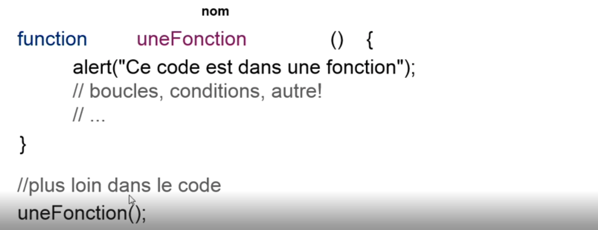

# Comprendre les fonctions

Un fonction est un bloc de code réutilisable

On identifie une fonction par son nom.

Son nom doit être parlant et en camelCase

Créer un fonction :

```
function nom(){

    // insctruction
}
```

Utiliser la fonction (faire appel à la fonction) : 

````
nom();
````

Vous pouvez passer des paramètres à une fonction :

```
function nom(param){

    // insctruction
}
```

Utiliser la fonction en passant les paramètre : 

````
nom(param);
````

Les paramètres passés peuvent être utilisé à l'intérieur de la fonction.


Un fonction peut retouner un valeur :

```
function nom(param){

    // insctruction
    
    return var;
}

var nom = nom(param);

```


## Comment utiliser une fonction en Javascript

N'oublions pas deux choses, il faut créer une fonction puis faire apple à cette fonction (l'utiliser).

Tant qu'une fonction n'est pas appellée, elle ne s'execute pas !




:exclamation: Toujours ecrire la fonction avant de l'appelée... L'ordre est très important!


## Passer des paramètre à une fonction

Lorsqu'on doit résoudre un problème plusieurs fois mais avec des variantes, on utilise des paramètres.

````javascript
function uneFonction(x,y){
    var uneVariable = x * y;
    alert(uneVariable);
}

uneFonction(5,10); // Affiche 50

uneFonction(1,10); // Affiche 10
````
Ci-dessus, on appel plusieurs fois la même fonction mais avec des paramètres différents donc le résultat est différent.

:exclamation: L'ordre et le nombre des paramètres est important !

Si x est passeé à la fonction après y, cela change totalement votre résultat

Si vous ajoutez un paramètre en plus de x et y, cela peut provoquer des erreurs

## Gérer le retour d'une fonction

Grâce au mot clé return, il est possible de retourner une valeur.

````javascript
function uneFonction(x,y){
    var uneVariable = x * y;
    
    return uneVariable;
}

var resultat = uneFonction(5,10); // resultat est égale à ce que la fonction va retourner donc dans ce cas 50
````

## Prendre connaissance de la portée des variables

Les variables initialisées dans la fonctions ne sont pas utilisable en dehors de la fonction.

````javascript
function uneFonction() {
  var testNum = 500;
  alert(testNum); // Affiche 500
}

alert(testNum) // Undefined car la variable n'est pas connue en dehors de la fonction
````

Si vous avez besoin de la même variable en dehors d'un fonction, vous devez créer une variable global


````javascript
var testNum = 500;
function uneFonction() {
  alert(testNum); // Affiche 500
}

alert(testNum) // Affiche 500
````

Ci-dessus, la portée de la variable est globale


