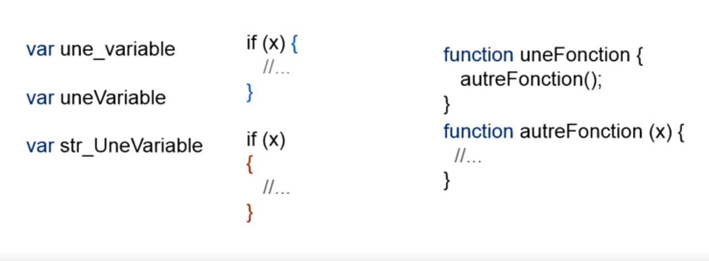

# Gérer votre code en programmation

Il y a des règles de base en programmation :

- Le code doit être lisible.
- Le code doit être maintenable.
- Le code doit être conforme, il doit respecter les règles en vigueurs liées au langage.
- Vous devez connaitre les bonnes pratiques du langage que vous utilisez. Dans chaque langage, il est possible de trouver la documentation sur les bonnes pratiques.
- Bien indenter son code.
- Rester constant donc si j'écrit mon code d'une telle manière, je ne change pas de style en cours d'écriture.

:exclamation: Au style d'écriture !



## Nommer les variables de code

Toujours donner un nom de variable compréhensible, des noms parlants !

Respecter les conventions de nommage lié au langage.

En javascript, vous devez utiliser le camelCase.

Exemple :

````javascript
var scorefinal; // Ne respecte pas les convention
var scoreFinal; // respecte les convention
````
Si le nom d'une variable est composé des plusieurs mots ou verbes, les séparations des mots se fait avec une majuscule.

C'est la même chose pour les fonction.

````javascript
function calculDistance() {
    
};
````

## Conventions de nommage

### Le Camel case

Convention : les mots sont liés sans espace. Chaque mot commence par une majuscule à l’exception du premier.

Exemples : monNomDeVariable, monUrl

C’est surement la convention la plus utilisée. On la retrouve en JavaScript, en Java, C++, C# et bien plus. C’est également la forme la plus rependu dans les hashtag Twitter. cette convention est aussi utilisée par certaine marque pour afficher leur appartenance au monde numérique comme c’est le cas pour eBay et iPhone. Quand on utilise des acronymes (URL, CSS, HTML, etc…) en Camel Case, seule la première lettre de ces derniers sont à mettre en majuscule.

### Le Pascal case

Convention : les mots sont liés sans espace. Chaque mot commence par une Majuscule.

Exemples : MonNomDeVariable, MonUrl

Cette convention est utilisée dans le langage de programmation Pascal ou encore pour nommer les class en PHP.

Comme pour le Camel Case, seule la première lettre des acronymes sont à mettre en majuscule. Cette convention est aussi utilisée par certaine marques pour communique un aspect novateur comme PlayStation, QuickTime ou MasterCard.

### Le Kebab case ou Spinal case

Convention : les mots sont en minuscule et sont liés par des tirets (-).

Exemples : mon-nom-de-variable, mon-url

Le kebab case est conseillé pour écrire les URL ainsi que pour nommer les images, PDF et autres fichiers à destination du web. En programmation, il sert par exemple à nommer les class et ID dans le code HTML et CSS.

Le nom Kebab case fait en réalité référence aux brochettes bien plus qu’au kebabs en eux même, comme une brochette de mots faite de tirets. Quant à Spinal case, il fait référence à la colonne vertébral.

### L’Underscore case ou Snake case

Convention : les mots sont en minuscule et sont liés par des undescores (tiret bas : _).

Exemples : mon_nom_de_variable, mon_url

L’underscore case, aussi appelé snake case, est utilisée en PHP, en Ruby ou encore en Phyton. Il existe une variante de cette convention. Nommée screaming snake case, qui consiste à mettre tous les mots en majuscule, toujours séparés par des underscore (Exemple : MON_MON_DE_CONSTANTE). On retrouve cette forme dans les noms de constantes en PHP ou encore pour nommer les exceptions en ADA.

[Source](https://wprock.fr/blog/conventions-nommage-programmation/)


## Commenter et zoner le code en programmation

Toujours commenter votre code !

Ainsi si un collègue doit effectuer un changement dans votre code, il comprendra mieux avec des commentaires claires.

Commenter intelligement.

Exemple en javascript en une ligne :

````javascript
// texte d'explication
````

Exemple en javascript en plusieurs lignes :

````javascript
/* texte d'explication
 Text
 Text
 Text
 Text
 */
````

Commentez mais pas de trop !

