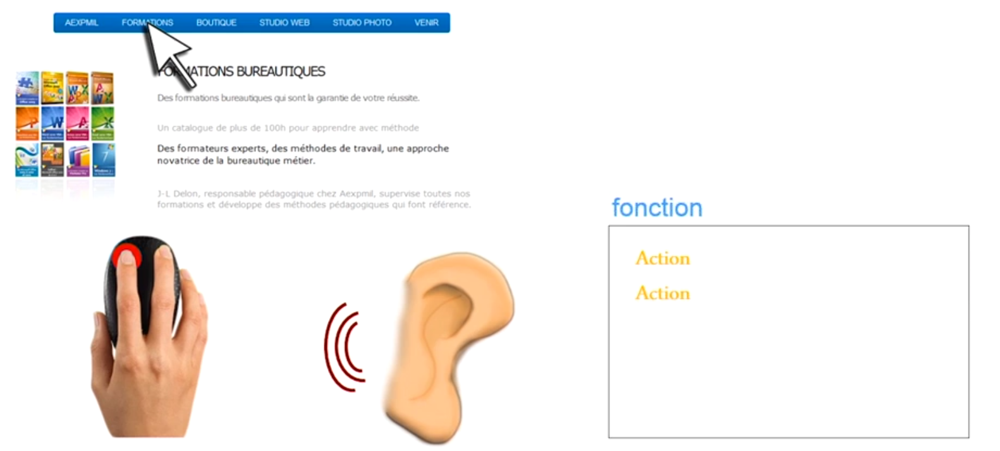

# Gérer les interactions avec l'utilisateur

## Présenter la programmation évènementielle

Lorsque vous créer une application avec une interface graphique, 
l'utilisateur peut interagir avec cette interface via son clavier et sa souris.

Du coup, ça laisse plus de liberté sur ce que peut faire ou non l'utilisateur.

Il faut donc que mon langage de programmation m'offre la **gestion des événements**.

**Qu'est ce que la gestion des événements ?**

En gros, j'affiche quelque chose et je laisse l'utilisateur faire ce qui veut. 
Par contre, je vais placer des écouteurs et ces écouteurs vont être chargé d'entendre ce que l'utilisateur fait.
Et en fonction de ce que fait l'utilisateur, l'application doit agir en executant des instructions.

Pour résumer, l'application va exécuter une instruction en fonction de l'événement déclanché par l'utilisateur.

Exemple sur un site Web :

Un utilisateur click sur un lien.

Le développeur a placé un écouteur sur ce lien et lorsqu'on click dessus, le site change de page.



**Comment construire un écouteur :**

- Placer un écouteur sur un objet
- Lier l'écouteur à une fonction (action)


**Ce que comprend un écouteur :**

- Comprends un écouteur et une fonction
- Est lié à un objet (un lien, un champ, un menu,...)
- Il écoute un événement précis (un click, un mouvement de sourie, un scroll,...)


Exemple en Javascript :

````javascript
function maFonction() {
  //process
}

élément.onClick = maFonction
````

Ci-dessus, on place un écouteur sur élément lorsqu'on click dessus et on actionne la fonction.

:exclamation: En Javascript, on écrit juste le nom de la fonction sans les parenthèses.

N'emboiter pas des fonctions dans d'autres fonctions car cela n'est pas sain en programmation.

Exemple a ne pas faire :-1: :

````javascript
élément.onClick = fonction(){
    //process
}
````

**Bonne pratique pour placer un écouteur d'événement en javascript  :+1: :**

````javascript
function maFonction() {
  //process
}

élément.addEventListener(type d'evenement, maFonction);
````

:exclamation: Toujours utiliser la manière ci-dessus.

[Plus d'infos](https://developer.mozilla.org/fr/docs/Web/API/EventTarget/addEventListener)


## Voir un exemple concret de gestion évènementielle en JavaScript


Principe :

1. Placer un écouteur pour savoir quand la page est chargé
    
    Lorsque vous aller sur un site Web, la page HTML peut prendre du temps à se charger donc il faut attrendre que tous les éléments soient présents.
    Car si votre fonction agis sur un éléments non présent, cela va provoquer une erreur !
    
    Ensuite, si la page à fini de chargé on place les autres écouteurs.
    
2. Déclencher une fonction qui va mettre un écouteur clavier lié à la page


3. Fonction pour afficher un message lorsque l'utilisateur appuie sur une touche.


En code :

````javascript
function messageSurToucheActive(){
    alert("Clavier actif");
}

function ecouteurClavier() {
  document.addEventListener("keypress", messageSurToucheActive)
}

window.onload = ecouteurClavier;
````

