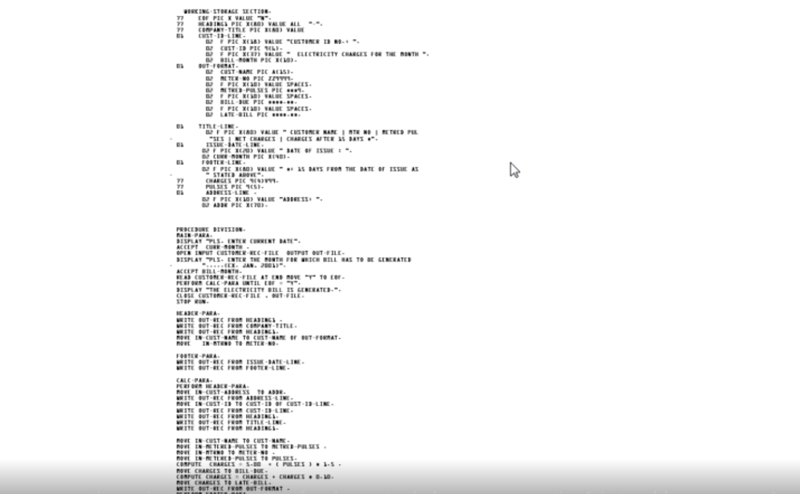
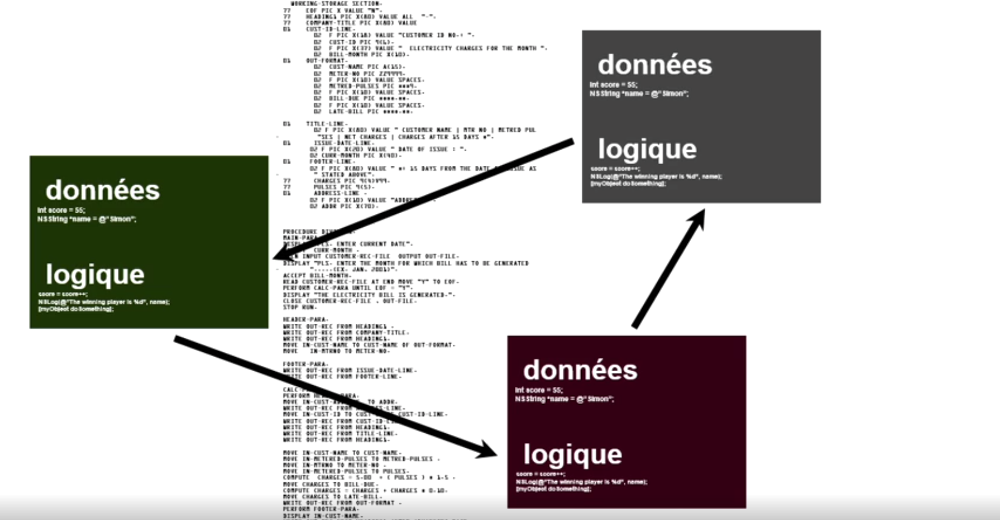
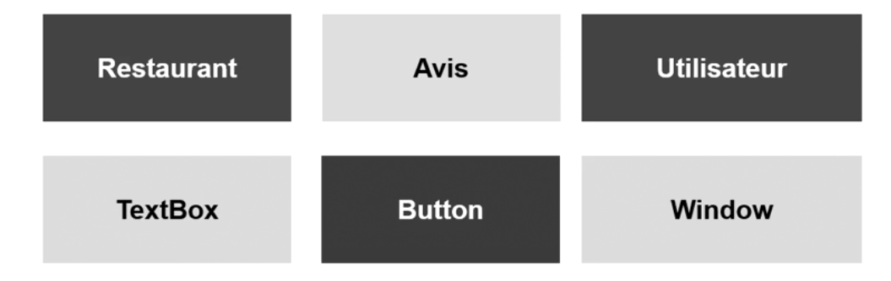

# S'initier à la programmation orientée objet

## Découvrir la programmation orientée objet

Il y a deux types des programmation :

- La programmation procédurale
    
    C'est une suite d'instruction.
    c'est une approche ligne à ligne.
    Votre code risque être long et difficile à lire.
    
    

- La programmation orienté objet

    Dans cette approche, nous utiliserons des blocs de code et chacuns d'eux aura sa propre logique et ses propres données.
    Chaques blocs peuvent communiquer les uns avec les autres.
    C'est beaucoup plus modulaire.
    Plus facilement maintenanble.
    
    

## Connaître les notions de classe et d'objet

Pour bien comprendre l'orienté objet, il faut comprendre ce qu'est une classe et un objet.

Une classe, c'est une idée et un objet, c'est la concrétisation de cette idée.

Une classe, c'est le plan, la définition, la description.

:bulb: Analogie

En construction, une classe est les plan de l'architecte. C'est une idée de la maison et non la maison en elle-même.

A partir de ces plans, on pourra construire la maison qui est l'objet.

Exemple de classe :




**Que definit une classe ?**

Dans une classe, il y a deux types d'elements principaux :

- les propriétés (caractéristiques)

    le nom, la taille, le poids, le genre,...

- les méthodes (actions)

    Macher, courir, sauter, parler,...
    
**L'objet**

Reprenons l'exemple de la construction. 

L'architecte à créé les plans (la classe) et à partir de ces plans, on va pouvoir construire une maison (l'objet)

L'objet est créé à partir de la classe.

Grâce à la **classe**, on peut créé plusieurs **objets**.


## Utiliser les classes du langage de programmation et l'objet Date de JavaScript


**Objets :**

````javascript
var tableau = [1,2,3,4,5]; //egal à un objet Array

var expression = /bonjour/; //egal à un objet RegExp
````

Ci-dessus, ce sont des objets, il y a des méthodes utilisables liées à ses objets :

````javascript
alert(tableau.length); // Affiche la longueur du tableau car length est un propriété de Array


alert(expression.test("bonjour")); // Affiche la valeur retournée pas la méthode test
````

**Ne pas confondre avec les primitives**

````javascript
var valeur = 123; // Ce n'est pas un objet car on ne peut rien faire d'autre que stocker une valeur

var estBon = true; // Ce n'est pas un objet car on ne peut rien faire d'autre que stocker une valeur
````

**Il y a plusieurs classes de base en javascript que vous pouvez utiliser :**

````javascript
var dteActuelle = new Date();
````

Le code ci-dessus, veut dire qu'à partir de la classe Date, je crée un objet de type date avec comme propriété valeur égal date du jour.

````javascript
var uneDate = new Date(2014,0,1);
````

Le code ci-dessus, veut dire qu'à partir de la classe Date, je crée un objet de type date avec comme propriété valeur égal à 01/01/2014.

Le deuxième 0, c'est le mois de janvier car l'index des mois commence par 0.

Nous pouvons de notre nouvel objet utiliser des méthodes :

````javascript
var uneDate = new Date(2014,0,1);

uneDate.getMonth(); // Retourne le numéro du mois correspondant à la date donc une valeur entre 0 et 11

uneDate.getFullYear(); // Retourne l'année YYYY (2014)

uneDate.getDate(); // Retourne le jour du mois entre 1 à 31

uneDate.getDay(); // Retourne le du jour de la semaine entre 0 à 6. 0 est égal à Dimanche car langage Américain
````

On peut également modifier l'objet grâce aux méthodes :

````javascript
var uneDate = new Date(2014,0,1);

uneDate.setMonth(5); // Va modifier le mois et il sera égal à 5

uneDate.setFullYear(2012); // Va modifier l'année et elle sera égal à 2012
````

Vous constaté que d'un côté nous avions les get et de l'autre les set.

Les get veulent dire "donne moi"

En langage de programmation les méthodes qui retourne une propriété s'appelle les accesseurs car il permettent d'accéder à une propriété.
Par convention, le nom d'un accesseur commence par get puis est suivi du nom du champ à retourner.

Les set veulent dire "modifie"

En langage de programmation les méthodes qui modifie une propriété s'appelle les mutateurs.
Par convention, le nom d'un mutateur commence par set puis est suivi du nom du champ à modifier.

[Plus d'infos](https://developer.mozilla.org/fr/docs/Web/JavaScript/Reference/Objets_globaux/Date)

## Utiliser les classes du langage de programmation et l'objet Math

````javascript
var x = 200.6;

var y = Math.round(x); // Egal à 201

var a = 200;
var b = 100000;
var c = 4;

var plusGrand = Math.max(a,b,c); // Egal 100000

var plusPetit = Math.max(a,b,c); // Egal 4
````

[Plus d'infos](https://developer.mozilla.org/fr/docs/Web/JavaScript/Reference/Objets_globaux/Math)


## Aller plus loin avec les classes et les objets

Lorsque vous créez un objet à partir d'une classe, on appelle ça "instancier une classe".

Lorsqu'on instancie une classe, on utilise la mot-clé new puis le nom de la classe.

Par convention, si vous créez une classe le nom doit commencer par une majuscule.

````javascript
var date = new Date();
````

Essayez de ne pas utiliser les raccourcis :

````javascript
var tableau = [1,2,3]; // Instancier un tableau de manière raccourcie

var tableau = new Array(1,2,3); // Instancier un tableau avec le mot-clé new
````

Il vaut utiliser le mot-clé new car dans certains langages, vous ne pourrez pas utiliser les raccourcis.

[Suite des notes pour l'orienté objet](./poo/sommaire.md)