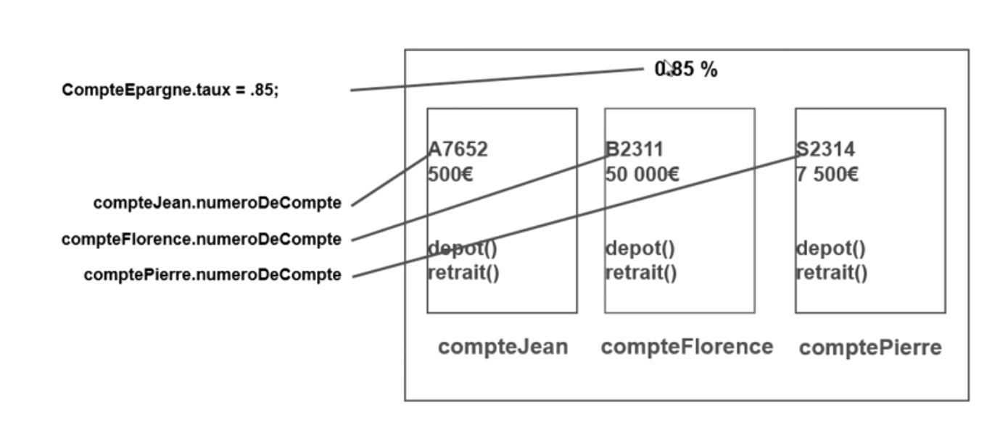

# Durée de vie d'un objet

## Instanciation

Dans la plupart des langages, on utilise le mot-clé new.

- Java : Client jean = new Client();
- C# : Client jean = new Client();
- VB.NET : Dim jean As New Client
- Ruby : jean = Client.new
- C++ : Client *jean = new Client();
- Objective-C : Client *jean= [[Client alloc] init];


## Constructeurs

Lors de l'instanciation, il est possible de initialiser les valeur de nos propriétés.

Pour ce faire lorsqu'on instancie, on passe en paramètre les valeurs à assigner.

Lors de l'instanciation, le programme comprends qu'il y a une méthode de type contructeur et fait appel à cette méthode.

Exemple en Javascript :

````javascript
class Personne {
  constructor(nom) {
    this.nom = nom;
  }
}

var personne = new Personne("Bloom");
````

Ci-dessus, lors de l'instanciation, on dit que la propriété nom est égal à Bloom

Dans la plupart des langage, il est possible d'utiliser les constructeurs.

- Java : la méthode qui porte le même nom que la classe est le constructeur
- PHP : la méthode __constuct est le constructeur
- Javascript : la méthode constructor est le constructeur


## Destructeur

Lorsque vous avez plus besoin d'un objet, il est préférable de le détruire pour libérer de la mémoire.

Il a un méthode dans la plupart des langage pour détuire un objet.

Avant de détruire un objet, vérifier qu'il n'est plus utile !


# Utiliser les membres statiques ou partagés

Dans certains cas, il est nécessaire de partager des méthodes ou des propriétés en sain d'une classe pour plusieurs objets.

On appelle ça des membres partagés (static).

Lorsqu'un classe possède une propriété qui a la même valeur sur tous les objets, nous créons un propriété de type static.

````javascript
class Personne {
  static nbrMembre() {
    return 4;
  }
}
````

Pour qu'une propriété soit la même sur tous les objet, on utilise le mot-clé static (connu par la plupart des langages).




Le mot-clé static peut s'appliquer sur une méthode.