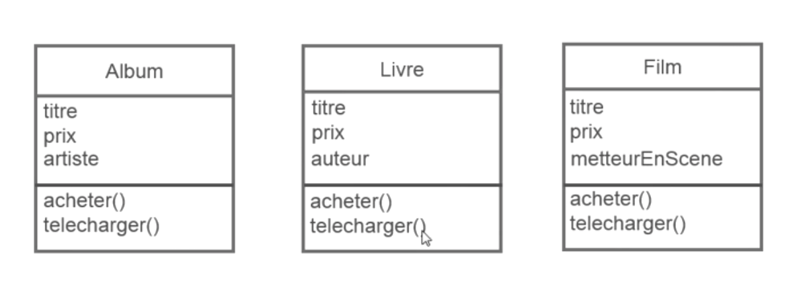
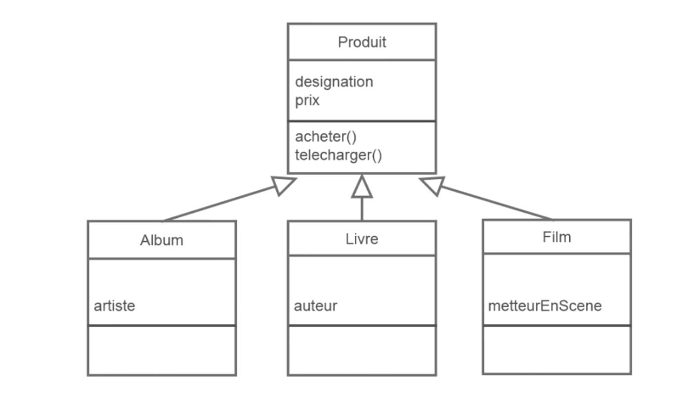
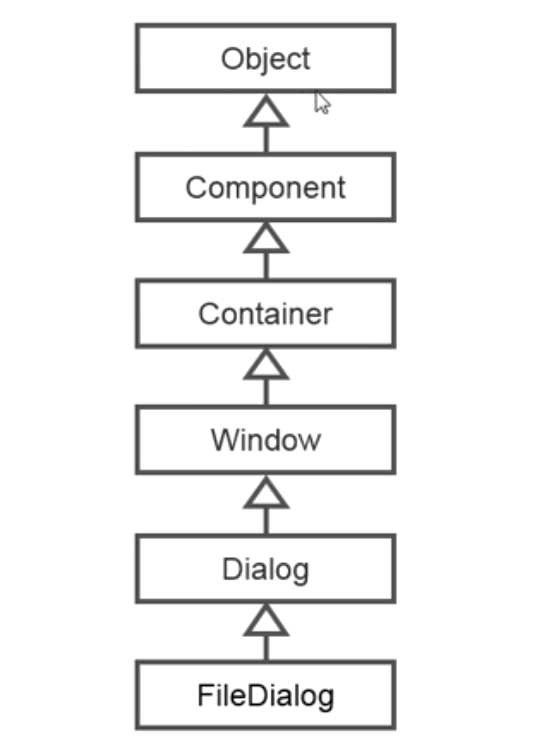
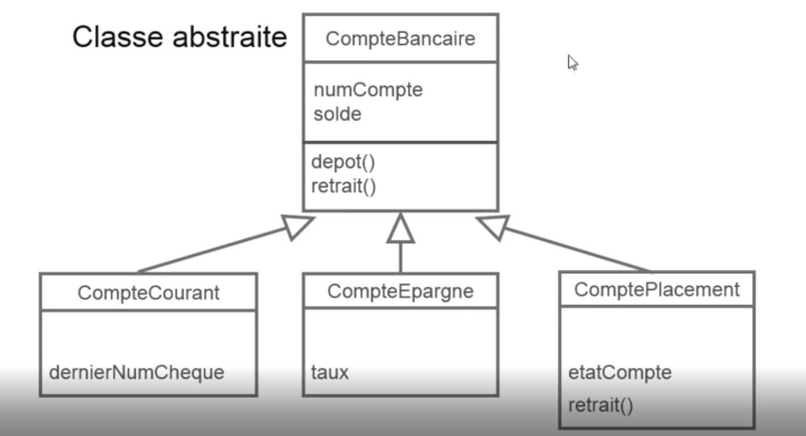
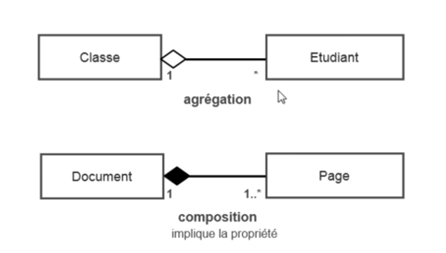

# Identifier les situations d'héritage

Pour savoir si c'est un héritage, on dit :

- cet classe est un(e) ...
- cet classe est un type de ...

:bulb: Analogie

Une voiture est un véhicule.

Donc la voiture hérite de véhicule.

Une bus est un véhicule.

Donc le bus hérite de véhicule.

Un employé est une personne.

Donc l'employé hérite de personne.

Un client est une personne

Donc le client hérite de personne.

Exemple :

Je crée 3 classes.

Je constate qu'il y a des élément communs dans chaque classes.

Donc je créer une classe parent pour que les trois classe hérite (des méthode et des propriétés) du parent.

Exemple en Java, on utilise l'héritage sans s'en rendre compte :

## Utiliser l'héritage

- Java : public class Album extends Produit {...
- C# : public class Album : Produit {...
- VB.NET : Public Class Album
            Inherits Produit ...
- Ruby : class Album < Produit ...
- C++ : class Album : public Produit {...
- Objective-C : @interface Album : Produit [...

**Appeler une méthode de la classe parent à partir de l'enfant**

- Java : super.methodeParent();
- C# : base.methodeParent();
- VB.NET : MyBase.methodeParent
- Ruby : super methodeParent();
- C++ : NomDeLaClasseParent::methodeParent();
- Objective-C : [super methode_parent];

## Utiliser les classes abstraites

:exclamation: Une classe abstraite ne peut pas être instancier.

Elle sert simplement de base aux autres classes.

## Utiliser les interfaces

Une interface est un peu comme une classe mais sans code réel à l'interieur.

Dans une interface, il n'y que des signature de méthode.

En résume, c'est le squelette des classes enfants.

Si une méthode est présente dans l'interface, elle devra être écrite dans la classe enfant.

Dans l'interface, les méthodes sont vides, elle n'ont pas d'instructions ! C'est les classes enfant que définissent les insctructions lié à la méthode.

:exclamation: La différence entre une classe abstraite et une interface

L'interface ne possède que la signature des méthodes. c'est à dire que les méthodes sont vides...

La classe abstraite possède les méthodes avec des instructions.

Dans les deux cas, ces classes ne peuvent être instanciées.

## Utiliser les agrégations et la composition

**agrégations**

L'agrégations d'une classe veut dire qu'elle peut avoir 1 à n relation (d'autre classe).

:bulb: Analogie

Un client **a une** adresse

Une voiture **a un** moteur

Une banque **a beaucoup** de comptes courants

**composition**

La seule différence entre l'agrégations et la composition, c'est qu'avec la composition l'objet enfant ne peut vivre sans le parent.

