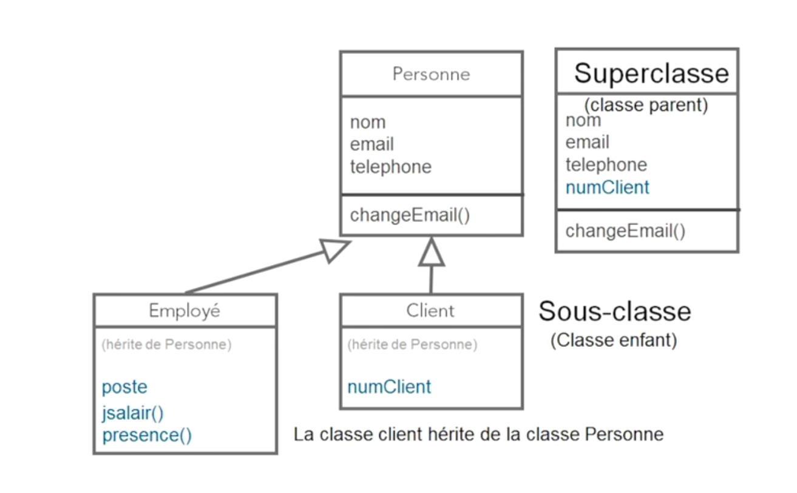

Dans la programmation orienté objet, il y a 4 idées principales :

1. **L'abstraction**

Le rôle de l'abstraction en programmation orienté objet est de se foncaliser sur l'éssentiel, c'est d'ignorer tous les détails.

Cela nous permet de visualiser un objet sans pour autant que l'objet soit décrit.

2. **Le polymorphisme**

Polymorphisme veut dire "peut prendre différentes formes".

:bulb: Exemple

Imaginons que je crée une classe CompteBancaire.

Cette classe a deux propriétés (numCompte et solde) et deux méthodes (depot() et retrait()).

Je crée ensuite 3 classes (CompteCourant, CompteEpargne et ComptePlacement) qui hérite de CompteBancaire.

La méthode retrait de la classe ComptePlacement n'effectue pas la même action que celle de CompteBancaire.

Je vais devoir réécrire la méthode retrait dans ComptePlacement, c'est ce qu'on appelle le polymorphisme d'héritage.

3. **L'héritage**

L'héritage est une manière pratique de réutiliser du code.

Cela nous permettra de créer une classe sans commencer d'une page vierge.

:bulb: Exemple

Nous avons créer une première classe personne.

Cette classe a comme propriété nom, email, téléphone et comme méthode changeEmail().

Ensuite, j'ai besoin d'une classe client.

Je constate que les deux classe sont presque identique sauf que client a une propriété supplémentaire (numClient).

Vous n'allez pas ajouter numClient dans la classe personne car cette n'en a pas besoin et elle possède tout ce qui est nécessaire (**abstraction**).

Du coup, je crée une classe client qui hérite de la classe personne. Grâce à cette héritage, je récupère les propriétés et les méthodes de personne.

Dans la classe client, j'ajoute seulement la propriété numClient.

Pour résumer, l'héritage va nous permettre d'économiser du code.

4. **L'encapsulation**

En programmation orienté objet, L'encapsulation fait référence à la notion de regrouper nos propriétés et nos méthodes au sain d'une même entité (la classe).

L'encapsulation permet également de restreinte l'accès aux informations de la classe et de révéler un nombre réduit d'information aux autres éléments de notre application.

Le principe est qu'objet ne révéle que le stricte nécessaire au autres partie du programme.

:bulb: Reprenons l'exemple du compte bancaire

Dans notre application, nous ne souhaitons pas que les autres parties de l'application puisse voir le solde.

Partez du principe que moins vous rendez les choses accessible, mieux c'est !

Donc mettez les en privé si elle ne sont pas utiles en dehors de la classe.

 