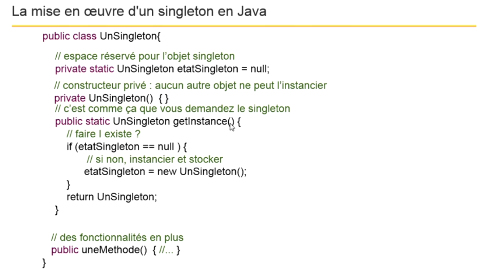
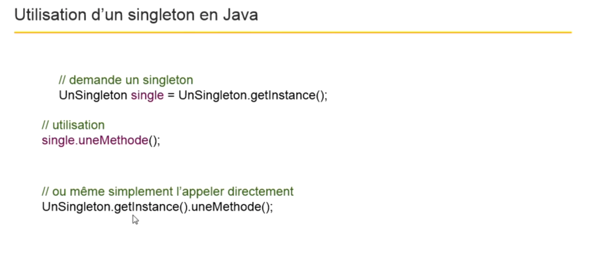

# Utiliser les patrons de conception (design pattern)

le patron de conception est un concepte destiné à résoudre des problèmes récurrents en programmation orienté objet.

les patrons de conception : 

- Ne sont pas des algorithmes ou des morceaux code.

- Sont là uniquement pour décrire des procédés de conception généraux et indépendant du language de programmation.

- Sont représentés sous forme de diagramme UML.

- Sont des solutions éprouvées et qui figures parmis les bonnes pratiques de programmation.

Ces patrons de conception sont connu grâce à [ce livre](https://www.amazon.fr/Design-Patterns-Elements-Reusable-Object-Oriented/dp/0201633612)

Les patrons de conception sont divisés en trois groupes :

- Les patrons de création (Creational Patterns)
  
  Termes : Abstract Factory, Builder Factory Method, Prototype Sigleton
  
  Ces patrons de création ce sont des approches qui traite de la création des objets. 
  Au lieu d'instancier tous les objets, ces patrons de conception vont vous donner une plus grande flexibilité dans la façon dont les objets sont créés.
  
  Le plus connu est le singleton.
  
- Les motifs structurels (Structural Patterns)

  Termes : Adapter Bridge, Composite Decorator, Facade Flyweight, Proxy
  
  Ces motifs structurels traite la manière dont les classes sont conçues.
  Ils vont nous aider dans les notions d'héritage, de composition, l'agrégation.
  Ils peuvent être utilisés pour fournir des fonctionalités supplémentaires.
  
- Les modèles de comportement
  
  Termes : Chain of responsibility, Command Interpreter, Memento Observer State, Strategy Template method, Visitor
  
  Ce groupe se concentre sur la communication entre les objets du programme en cours d'exécution.
  
  

## Connaître le pattern singleton

Singleton est un des patron de conception qui est très connu.

Ce patron est là pour répondre à la problématique suivante :

Comment avoir qu'une seule instance d'une certaine classe dans une application ?

Et aussi, comment y accéder ?

Exemple :

Une application Web dynamique, la connection à une serveur de base de donnée doit être unique.

Pour préserver cette unicité, nous allons travailler avec un objet avec la forme du singleton. 

Le singleton est mis en oeuvre en écrivant une classe contenant une méthode statique qui crée une instance s'il n'y en a pas déjà une sinon elle renvoie une référence de celle déjà instanciée.

## Connaître le pattern memento

Il sert à pouvoir annuler un état dans un objet (annuler une modification) sans violer l'encapsulation.

Typiquement dans la plupart des logiciels c'est l'action undo/redo.

Comment cela s'organise ?

Nous avons besoin de trois classes pour le réaliser : 

- La classe Createur

  La classe Createur utilise Souvenir et envoie ses Souvenir d'état au Gardien
  

- La classe Gardien 
    
  Son rôle est de garder en mémoire l'état originale qui sera envoyé par le Createur.
  
  Il gère également les souvenirs d'état.
  
  Lorsque le Createur veut revenir à un état précédent, il demande au Gardien de lui renvoyer le Souvenir correspondant.

- la classe Souvenir

N'essayez de réinventé la roule, utilisez un patron de conception qui a déjà fait ses preuves.

Liens utiles :

- [Design Patterns - PHP](https://openclassrooms.com/fr/courses/1665806-programmez-en-oriente-objet-en-php/1668103-les-design-patterns)