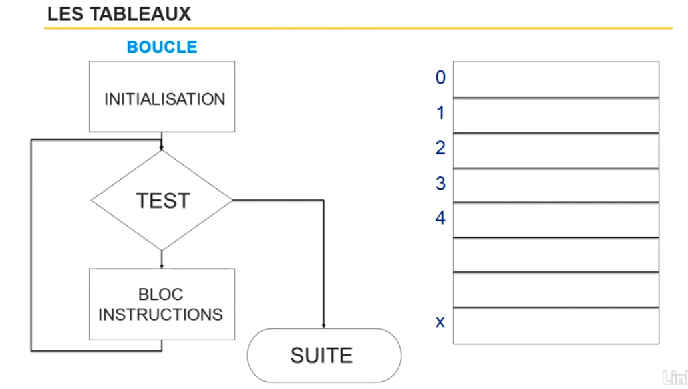

# Insérer des tableaux en programmation

Un tableau est un peu comme une armoire. Cette armoire a des étagères qui sont numérotée de 0 à x (index). Chaque étagère possède du contenu (valeur).

Si on souhaite parcourir ce tableau, nous pouvons utiliser une boucle.



Imaginons que nous souhaitons voir le contenu de l'étagère numéro 3...

Cette armoire à un nom (nom unique) et grâce à ce nom et au index, nous pouvons accéder aux étagère de cette armoire.

Accéder une étagère particulière : Nom du tableau[index]

Sur une étagère, vous pouvez mettre tout type de données (texte, nombre, boolean, date, etc). Vous pouvez mélanger les types également.

Il n'est pas obligatoire d'avoir le même type de donnée sur toutes les étagères.

:exclamation: Un tableau est en langage de programmation un objet de type tableau donc un tableau possède des propriétés et des méthodes.

Plus d'informaton sur les objets : [Les objets](objet.md)

**Propriétés des tableaux**

Créons un tableau en javascript :

Manière traditionnelle :
```
var unTableau = [10,20,"test",vrai,99];
```

Ou

Manière plus moderne, on instanciant l'objet Array :
```
var unTableau = new Array(10,20,"test",vrai,99);
```


Il y a la propriété length qui permet d'obtenir le nombre d'élément dans un tableau. Le code ci-dessous appel une propriété interne à notre tableau.
Car tout tableau possède plusieurs propriétés.

```
alert(unTableau.length); // est égale à 5 car il y a 5 éléments
```

Si je souhaite voir ce qu'il y a dans le dernière élément du tableau , j'utilise le nom du tableau et l'index du derniere élément mais l'index du dernière élément n'est pas égale à sa longueur (5).

Les index du tableau commence par 0 donc si on souhaite le dernier, nous prenons longueur moins 1.

```
var dernierIndex = unTableau.length - 1; // égale 4
unTableau[dernierIndex];
```


**Méthodes des tableaux**

```
var unTableau = [10,"a",1,40,50];
```


Le code ci-dessous appel une méthodes interne à notre tableau.
Car tout tableau possède plusieurs méthodes.

```
unTableau.reverse();
```

La méthode reverse va inverser l'ordre du tableau.


```
unTableau.sort();
```

La méthode sort va trier les valeaurs du tableau.

```
unTableau.concat(unTableau2);
```

La méthode concat va concaténer (joindre) deux tableaux.

```
var dernierItem = unTableau.pop();
```

La méthode pop va faire sauter la dernère valeur du tableau et cette valeur sera stockée dans la variable dernierItem.


```
unTableau.push(123);
```

La méthode push va ajouter une valeur à la fin du tableau (la valeur en paramètre de la méthode).

Si vous souhaitez connaitre plus de méthodes pour les tableaux, allez sur ce lien : [Array](https://developer.mozilla.org/fr/docs/Web/JavaScript/Reference/Objets_globaux/Array)

**Parcourir un tableau**

Tant que i est plus petit que la longueur du tableau affiche la valeur stockée dans le tableau de l'index courant.

```
var unTableau = [10,20,"test",vrai,99];

var i = 0;

while(i < unTableau.length){

    alert("La valeur est:" + unTableau[i])
    //...
    i++;
}
```


**Tableau à deux dimensions**

```
var noms = new Array("Dupont", "Truel", "Marconi");
var prenoms = new Array("jean", "pierre", "paolo");
var monTableau = new Array(noms, prenoms);

alert(monTableau[0][2]); //Affiche Marconi
```


**Données autorisées dans un tableau**

Il y a des langage pour permettent de mélanger les types de données dans un tableau.

Mais dans certains langages, il faut typer son tableau, typer les valeurs que seront stockées dans ce tableau.


**Taille fixe ou modifier la taille des tableaux**

Il y a des langage pour permettent d'avoir des tableaux avec des tailes variable, l'avantage est la souplesse du tableau.

Mais dans certains langages, il faut définir à l'avance la taille du tableau, l'avantage sera que l'ordinateur sera plus rapide pour le manipuler.


Si le langage le permet, priviliéger les tableaux a taille fixe pour plus de rapidité d'execution.

Exemple, si vous désirer un tableau avec les jours de la semaine, vous pouvez utiliser un tableau de taille fixe.

**Tableaux associatifs**

Si nous reprenons l'exemple de l'armoire, vous avez remarquez que l'index se crée dynamiquement (automatique) mais dans certains cas vous avez besoin de connaitre et de gérer vous même les index. Donc vous utiliserez un tableau associatifs.

De plus, celui-ci vous permet d'accéder au valeur plus facilement car vous connaissez vos index.


---------------------------------------------
[Retour au sommaire](README.md)


