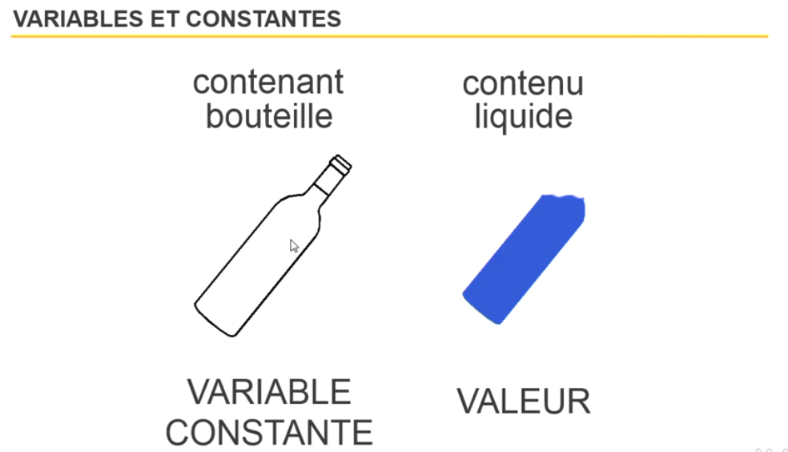
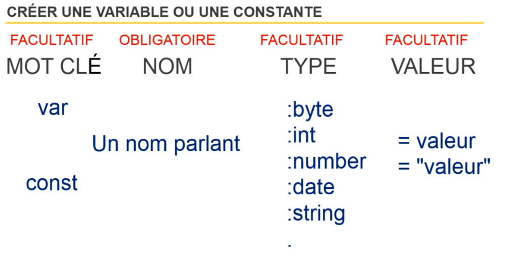
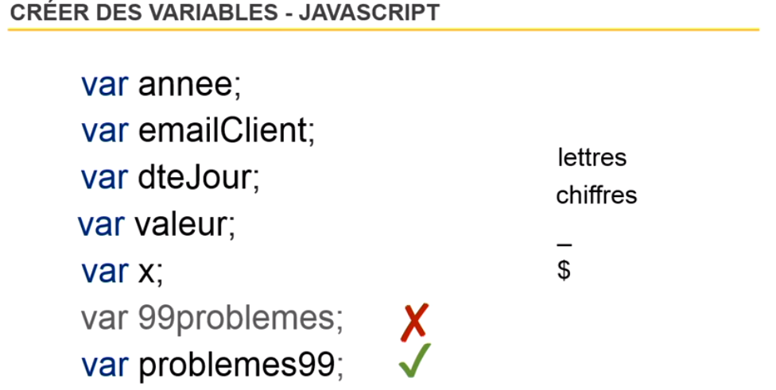

# Découvrir les constantes, variables et opérateurs

## Variable

**Qu'est qu'une variable ou une constante ?**

Les constantes ou les variables sont des zones en mémoire à l'intérieur des quelles nous pouvons stocker des valaurs (nombre, texte, date, etc).

La différence entre une constante et une variable, c'est que la constante n'évoluera pas (ou très peu) mais la variable évoluera constamment.

Explication visuelle :



**Créer une variable**

Le nom de votre variable doit être compréhensible, doit être parlant.




**Typage**

- Typage faible (javascript)
    
    Sans typage, je peux mettre n'importe quoi dans ma variable et passer d'un type String à un type Int...

    De plus, ça n'améliore pas la lisibilité du code (moins compréhensible).

```
    var nomDeVariable;
    nomDeVariable = 200; //type Int
    nomDeVariable = "bonjour"; //type String
    nomDeVariable = 'bonjour'; //type String
    nomDeVariable = false; //type Boolean
```


- Type fort (AS3)
    
    L'avantage est que le système se rend compte que des erreurs de typage sont présentent. Plus le code est stricte, moins vous êtes susceptible d'obtenir des erreurs.

```
    var nomDeVariable:type;

    var nomDeVariable:int = 200;
    var nomDeVariable:String = "bonjour";
    var nomDeVariable:String = 'bonjour';
    var nomDeVariable:String = false;
```


**Créer une variable en Javascript**




Si votre variable n'a pas de valeur, elle sera "undefined".
Les noms de variable sont sensible à la case (majuscule ou minuscule).


## Opérateurs arithmétiques

**Les opérateurs : **

- '+' addition
- '-' soustraction
- '/' division
- '*' multiplication


```
var a = 100;
var b = 50;

Var resultat = a + b; // 150
Var resultat = a * b; // 5000
Var resultat = a - b; // 50
Var resultat = a / b; // 2
```


**Ordre des opérateurs**

Attention, si vous enchaînez les opérations, l'ordre des opérateurs est important!

resultat = 5 + 5 * 10; // 55

Avec le calcul ci-dessus, l'ordinateur va commencer par la multiplication puis l'addition.

Si je veux changer l'ordre, il faut utiliser les parenthèses. L'ordinateur calculera d'abord ce qui est le plus entre des parenthèses vers le moins entre parenthèses.

resultat = (5 + 5) * 10; // 100


**Modification d'une variable déjà crée**

```
var score = 10;

score = score + 10; // 20
```

OU

```
var score = 10;

score += 10; // 20
```


**Incrémenter ou décrémenter**

```
var a = 1;

a++; // Ajoute 1

a--; // Soustrait 1

```


**Modulo**

```
var annee = 2003;

var reste = annee % 4; // 3

```

Ci-dessus, je demande le reste de la division de annee/4.

Le reste de la division est de 3 donc je peux en déduire que 2003 n'est pas une année bissextile car 3 n'est pas un chiffre paire.

**Opérateurs de comparaison**

- '=' égale // monde Microsoft (VBA, etc...) !
- '==' égale
- '<' plus petit
- '>' plus grand
- '<=' plus petit ou égale
- '>=' plus grand ou égale
- '!=' différent
- '<>' différent


```
if(a == b){}// Est-ce égal ?

if(a != b){}// Est-ce différent ?

if(a === b){}// Est-ce égal en valeur et en type ?

if(a !== b){}// Est-ce différent en valeur ou en type ?

if(a > b){}// Est-ce supérieur ?

if(a < b){}// Est-ce inférieur ?

if(a >= b){}// Est-ce supérieur ou égale ?

if(a <= b){}// Est-ce inférieur ou égale ?

```


**Opérateurs avec =**

- = affectation
- == égalité
- === égalité stricte


## Opérateurs logiques

- ET
- OU

le ET peut s'écrire ``AND`` ou ``&&``, dépend du langage

le OU peut s'écrire ``OR`` ou ``||``, dépend du langage


```
if(a === b && c === d){}

if(a === b || c === d){}

if((a > b) && (c < d)){}
```


---------------------------------------------
[Retour au sommaire](README.md)